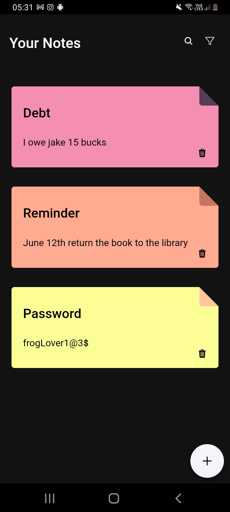
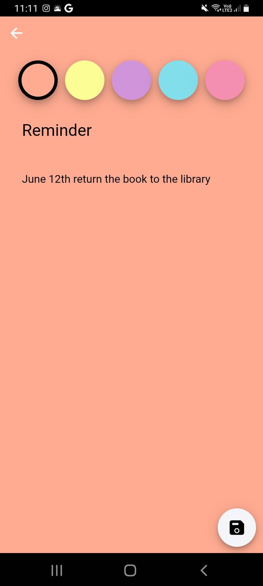

# Notes App

This is a project inspired by [Phillip Lacker](https://github.com/philipplackner) in one of [his youtube videos](https://ionicframework.com/docs/intro/cli), re-written using ionic

## Preview
### Main Page


### Add / Edit Page


## Features
- View notes
- Add new notes
- Edit added notes
- Delete added notes
- Sort notes by color, title, or date added

## Known Limitation
1. Currently unable to be run on web
2. Has not been tested on ios

## How to run this app

1. Clone this project
2. Install the ionic framework, [Here's a guide on how to do that](https://ionicframework.com/docs/intro/cli)
3. Run these command
```
ionic build
ionic cap sync
ionic cap add android
ionic cap add ios
```
4. Then you can run the compiled code on your targeted platform